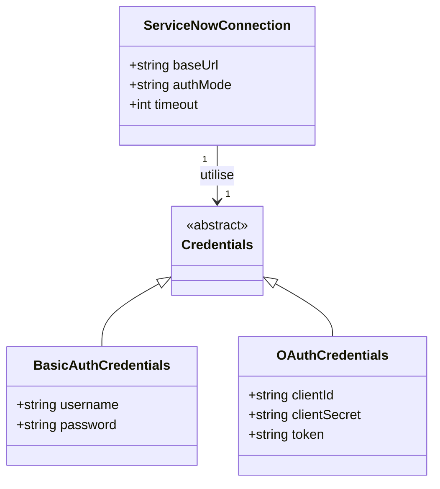
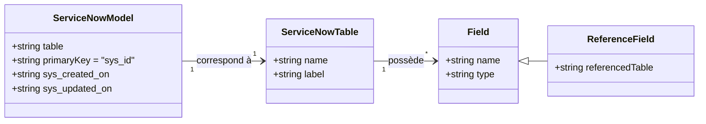
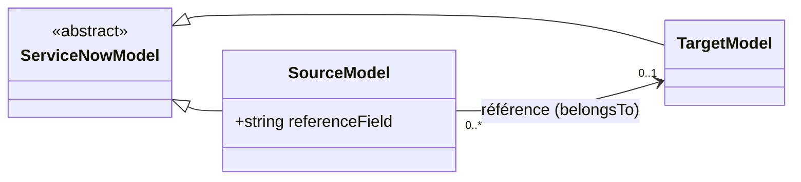

# SFD - Driver ServiceNow : accès CRUD générique via Eloquent

## Objectif

Permettre à toute application Laravel d'utiliser le plug-in `snow-driver` pour manipuler les enregistrements d'une instance ServiceNow (tables quelconques) au travers de modèles Eloquent standards, en s'appuyant sur l'API REST Table de ServiceNow. Le périmètre couvre les opérations CRUD complètes (création, lecture, modification, suppression) mais exclut toute synchronisation ou mise en cache local des données.

## Diagrammes de classes

### Connexion et authentification

### Modèle, table et champs

### Relations entre modèles (champs de référence)

## Exigences fonctionnelles

### Connexion et authentification à ServiceNow

**Exigence EX-101** ► Le driver doit permettre de configurer une connexion à une instance ServiceNow via l'URL de base de l'instance, déclarée dans la configuration de connexion Laravel (config/database.php). ◄

**Exigence EX-102** ► Le driver doit supporter l'authentification par Basic Auth (identifiant et mot de passe) configurée au niveau de la connexion, pour le périmètre MVP. ◄

**Exigence EX-103** ► Le driver doit exposer une architecture d'authentification extensible permettant l'ajout ultérieur du mode OAuth2 (client credentials) sans modification de l'API publique du driver. ◄

**Exigence EX-104** ► Chaque requête envoyée à l'API ServiceNow doit inclure les identifiants configurés pour la connexion active, sans que ces identifiants n'apparaissent en clair dans les journaux applicatifs. ◄

**Exigence EX-121** ► La connexion à ServiceNow doit être établie de manière paresseuse : une configuration de connexion absente ou invalide ne doit déclencher une exception qu'au moment de la première requête effective vers l'API, et non au démarrage de l'application. ◄

> [!WARNING]
> Des identifiants absents ou invalides ne sont détectés qu'à l'usage (première requête) ; aucune validation n'est effectuée au démarrage de l'application.

**Exigence EX-126** ► Une tentative de connexion à une instance ServiceNow injoignable ou ne répondant pas dans le délai configuré (timeout) doit déclencher une exception dédiée, distincte d'une exception d'authentification. ◄

### Mapping des modèles Eloquent vers les tables ServiceNow

**Exigence EX-105** ► Un modèle Eloquent utilisant le driver snow-driver doit être automatiquement associé à la table ServiceNow dont le nom technique correspond à la convention Eloquent standard (nom de table dérivé de la classe, ou surcharge explicite via la propriété $table). ◄

**Exigence EX-106** ► Le champ sys_id (chaîne de 32 caractères hexadécimaux non incrémentale générée par ServiceNow) doit être utilisé comme clé primaire de type chaîne, non auto-incrémentée, de tout modèle Eloquent mappé à une table ServiceNow. ◄

**Exigence EX-107** ► Les champs sys_created_on et sys_updated_on doivent être mappés respectivement sur les conventions Eloquent created_at et updated_at, afin de conserver la gestion native des timestamps par Eloquent. ◄

**Exigence EX-127** ► La résolution d'un modèle vers une table ServiceNow inexistante ou inaccessible pour l'utilisateur configuré (droits d'accès insuffisants) doit produire une exception explicite, plutôt qu'un résultat vide silencieux. ◄

### Consultation des enregistrements

**Exigence EX-108** ► Le driver doit permettre de récupérer un ou plusieurs enregistrements d'une table ServiceNow via l'API Table (méthode GET), au travers des méthodes standards Eloquent telles que all(), get(), find() et first(). ◄

**Exigence EX-109** ► Le driver doit traduire les clauses where() du query builder Eloquent en requête encodée ServiceNow (paramètre sysparm_query), en respectant la syntaxe des opérateurs de l'API Table. ◄

**Exigence EX-110** ► Le driver doit traduire les méthodes Eloquent de limitation et de décalage (take/limit, skip/offset, paginate) en paramètres sysparm_limit et sysparm_offset de l'API Table. ◄

**Exigence EX-111** ► Le driver doit traduire la méthode Eloquent orderBy() en directive de tri intégrée à la requête encodée ServiceNow (sysparm_query), l'API Table ne proposant pas de paramètre de tri séparé. ◄

**Exigence EX-122** ► Lorsqu'une méthode de lecture sans limite explicite (all(), get()) est utilisée et que le nombre d'enregistrements à récupérer dépasse la limite maximale autorisée par requête par l'API Table de ServiceNow, le driver doit automatiquement enchaîner les appels paginés nécessaires (décalage croissant), de manière transparente pour l'appelant. ◄

Ce découpage automatique ne concerne que les méthodes sans limite explicite ; un appel paginate() avec une taille de page explicite continue de correspondre à un seul appel à l'API Table par page.

**Exigence EX-128** ► Une clause du query builder Eloquent sans équivalent dans la syntaxe de requête de l'API Table de ServiceNow doit lever une exception explicite, plutôt que produire une traduction silencieuse incorrecte. ◄

**Exigence EX-133** ► Toute requête adressée par le driver à l'API Table de ServiceNow (consultation des enregistrements, résolution d'une relation belongsTo, interrogation du dictionnaire) doit demander l'omission du lien REST porté par la valeur brute de chaque champ de type reference, ce lien n'étant exploitable par aucun consommateur direct de la connexion. ◄

Un appelant du client HTTP interne qui fournit lui-même le paramètre gouvernant cette omission conserve la main : sa valeur prévaut sur celle appliquée par défaut par EX-133.

**Exigence EX-132** ► ~~Les valeurs des champs booléens, entiers et décimaux doivent être converties vers leur type natif PHP (bool, int, float) selon le type déclaré au dictionnaire de la table interrogée, avant que la donnée n'atteigne le query builder Eloquent ou tout consommateur direct de la connexion — l'API Table de ServiceNow ne renvoyant ces valeurs que sous forme de chaîne, à la différence d'un pilote SQL classique qui les typerait déjà nativement.~~ ◄ *(supprimée)*

La mise en place systématique des casts dans les modèles générés a rendu superflue l'exigence EX-132.

### Création, modification et suppression des enregistrements

**Exigence EX-112** ► Le driver doit permettre de créer un enregistrement dans une table ServiceNow via l'API Table (méthode POST), au travers de la méthode standard Eloquent save() appliquée à une nouvelle instance de modèle. ◄

**Exigence EX-113** ► Le driver doit permettre de modifier un enregistrement existant via l'API Table (méthode PUT ou PATCH), au travers des méthodes standards Eloquent save() sur une instance existante ou update(). ◄

**Exigence EX-114** ► Le driver doit permettre de supprimer un enregistrement via l'API Table (méthode DELETE), au travers de la méthode standard Eloquent delete(). ◄

**Exigence EX-115** ► À l'issue d'une création ou d'une modification, le modèle Eloquent doit être automatiquement actualisé avec les valeurs retournées par ServiceNow (champs calculés ou valeurs par défaut positionnées côté serveur). ◄

**Exigence EX-123** ► Lors d'une opération groupée sur plusieurs enregistrements (par exemple saveMany), chaque enregistrement doit être traité indépendamment des autres : l'échec d'un enregistrement ne doit pas annuler les enregistrements du même lot déjà traités avec succès, et le driver doit retourner le détail des succès et des échecs. ◄

> [!WARNING]
> Aucune garantie d'atomicité n'est fournie sur les opérations groupées : l'API Table de ServiceNow ne proposant pas de transaction multi-requêtes native, un traitement best-effort est retenu plutôt qu'un rollback applicatif.

**Exigence EX-124** ► Le driver ne doit implémenter aucun mécanisme de détection ou de résolution de conflit de modification concurrente ; en cas d'écritures concurrentes sur le même enregistrement (même sys_id), le comportement observé est celui nativement appliqué par l'API ServiceNow (dernier écrivain gagnant), sans contrôle additionnel côté driver. ◄

**Exigence EX-131** ► Une mise à jour ou une suppression de masse effectuée directement via le query builder Eloquent, sans passer par une instance de modèle chargée (par exemple Model::where(...)->update([...]) ou Model::where(...)->delete()), doit lever une exception ServiceNowUnsupportedQueryException, l'API Table ServiceNow ne proposant pas d'opération de modification ou de suppression par critère de filtre. ◄

EX-113 et EX-114 ne couvrent que save()/update()/delete() appliquées à une instance de modèle déjà chargée ; l'exception d'EX-131 doit être levée avant tout appel réseau, afin d'éviter la remontée d'une erreur PHP bas niveau non maîtrisée vers l'application appelante.

### Relations entre modèles via champs de référence

**Exigence EX-116** ► Un champ ServiceNow de type reference doit pouvoir être exposé comme une relation belongsTo Eloquent vers le modèle correspondant à la table référencée. ◄

**Exigence EX-117** ► La déclaration d'une relation basée sur un champ de référence doit suivre la syntaxe standard des relations Eloquent (méthode de relation définie sur le modèle), sans DSL propriétaire supplémentaire. ◄

**Exigence EX-118** ► Le chargement d'une relation de référence doit pouvoir être réalisé en différé (lazy loading) ou par anticipation (eager loading via with()), selon les mécanismes standards Eloquent. ◄

**Exigence EX-129** ► Un champ de référence dont la valeur est vide (sys_id nul) doit résoudre la relation Eloquent correspondante à null, plutôt que de lever une exception. ◄

**Exigence EX-125** ► Lorsqu'un champ de référence pointe vers un sys_id dont l'enregistrement est introuvable (supprimé) côté ServiceNow, la relation Eloquent correspondante doit être résolue à null. Lorsque la résolution échoue en raison de droits d'accès insuffisants (réponse HTTP 403), une exception dédiée doit être levée afin de distinguer ce cas d'une simple absence de donnée. ◄

La distinction entre un enregistrement introuvable (404, résolu à null) et un accès refusé (403, exception) repose sur le code de statut HTTP retourné par l'API ServiceNow lors de la résolution de la référence.

### Gestion des erreurs de l'API ServiceNow

**Exigence EX-119** ► Toute réponse d'erreur HTTP de l'API ServiceNow (codes 4xx ou 5xx) doit être traduite en exception PHP dédiée, portant le code et le message d'erreur retournés par ServiceNow. ◄

**Exigence EX-120** ► Une erreur d'authentification (codes 401 ou 403) doit être distinguée des autres erreurs API par une exception spécifique, afin de permettre une gestion différenciée côté application appelante. ◄

**Exigence EX-130** ► Une réponse de l'API ServiceNow malformée ou vide (coupure réseau, timeout partiel) doit déclencher une exception dédiée, plutôt qu'un plantage silencieux ou un résultat par défaut trompeur. ◄
