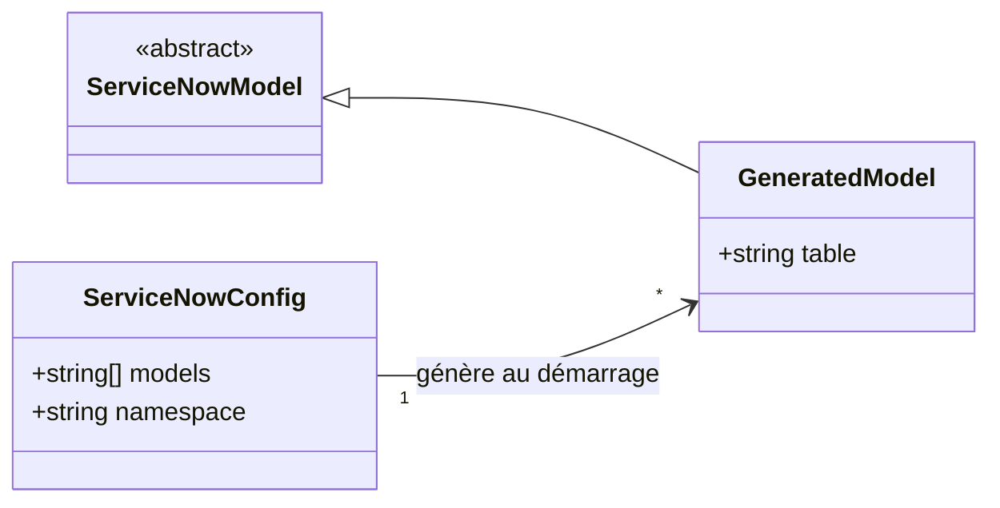
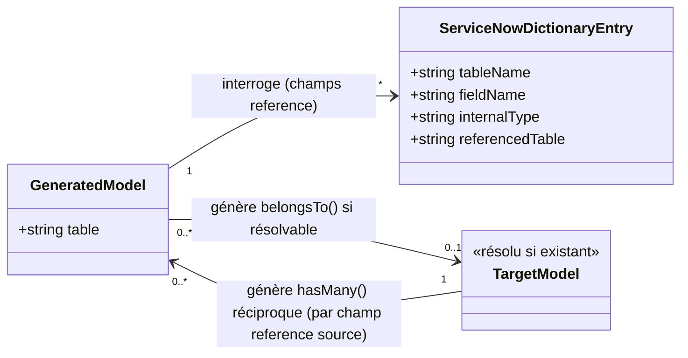

# SFD - Génération de modèles ServiceNow : scaffolding automatique pour l'application hôte

## Objectif

Permettre au plug-in `snow-driver` de générer automatiquement, dans le code source de l'application hôte, des modèles Eloquent prêts à l'emploi pour un ensemble de tables ServiceNow déclarées en configuration, ainsi que leurs relations `belongsTo` vers les tables référencées et les relations inverses `hasMany` réciproques entre tables configurées, sans intervention manuelle du développeur. Ce module s'appuie sur le module 1 ([1. Driver ServiceNow.md](1.%20Driver%20ServiceNow.md)) : chaque modèle généré hérite de `ServiceNowModel` et bénéficie nativement de toutes ses capacités d'accès CRUD.

## Diagrammes de classes

### Modèles générés automatiquement depuis la configuration

### Génération des relations depuis le dictionnaire ServiceNow

## Exigences fonctionnelles

### Modèles générés automatiquement pour les tables ServiceNow configurées

**Exigence EX-201** ► Le fichier de configuration du driver doit permettre de déclarer un tableau des noms techniques des tables ServiceNow pour lesquelles un modèle Eloquent doit être généré. ◄

**Exigence EX-202** ► Au démarrage de l'application hôte, le driver doit vérifier pour chaque table déclarée si un fichier de classe de modèle correspondant existe déjà, dans le namespace configuré, dans le code source de l'application hôte ; s'il est absent, il doit le générer automatiquement, sans intervention du développeur. ◄

**Exigence EX-203** ► Le nom de la classe générée pour une table doit être dérivé du nom technique de cette table selon une conversion en casse Pascal (StudlyCase), et le fichier généré doit associer explicitement le modèle à cette table ServiceNow d'origine, sans dépendre de la convention de dérivation table ↔ classe standard d'Eloquent. ◄

**Exigence EX-204** ► Un modèle généré doit offrir les mêmes capacités qu'un modèle ServiceNow déclaré manuellement (lecture, écriture, relations par champ de référence), au même titre que tout modèle héritant de ServiceNowModel. ◄

**Exigence EX-205** ► Le fichier de configuration doit permettre de préciser un namespace PHP global, appliqué à l'ensemble des modèles générés, avec App\Models comme valeur par défaut si ce réglage n'est pas renseigné. ◄

> [!WARNING]
> Si le fichier de classe attendu pour une table existe déjà, le driver ne doit ni le régénérer ni l'écraser, afin de préserver toute personnalisation manuelle apportée par le développeur depuis la première génération.

> [!WARNING]
> Si le système de fichiers de l'application hôte est en lecture seule au moment du démarrage (ex: déploiement conteneurisé immuable), l'échec d'écriture du fichier de modèle ne doit pas empêcher le démarrage de l'application ; il doit être signalé sans bloquer le boot.

> [!WARNING]
> En environnement où l'autoloader Composer est optimisé avec une classmap figée (typiquement en production), un modèle nouvellement généré au démarrage peut ne pas être immédiatement utilisable durant la requête en cours qui a déclenché sa génération ; ce mécanisme automatique vise avant tout un usage en développement.

> [!WARNING]
> Si le namespace configuré n'est pas rattaché à un dossier du code source de l'application hôte selon les règles standards d'autochargement PSR-4 (namespace non enraciné sous App\), le driver doit signaler explicitement son incapacité à résoudre un emplacement de fichier valide, plutôt que de deviner ou de forcer un chemin arbitraire.

> [!WARNING]
> Un tableau de configuration absent ou vide ne doit déclencher la génération d'aucun fichier et ne doit produire aucune erreur au démarrage de l'application hôte.

### Génération automatique des relations de référence depuis le dictionnaire ServiceNow

**Exigence EX-206** ► Lors de la génération d'un modèle pour une table configurée, le driver doit interroger le dictionnaire ServiceNow (table sys_dictionary) afin d'identifier les champs de type reference définis sur cette table. ◄

**Exigence EX-207** ► Pour chaque champ reference identifié, si la table qu'il référence dispose déjà d'un modèle Eloquent résolvable (généré ou déclaré manuellement) dans le namespace configuré, le driver doit générer dans le fichier du modèle une méthode de relation belongsTo() vers ce modèle, nommée d'après le nom du champ suffixé de « Record » (ex : champ company → méthode companyRecord()). ◄

**Exigence EX-208** ► Un champ reference dont la table référencée ne dispose d'aucun modèle Eloquent local résolvable ne doit donner lieu à aucune génération de relation ; il doit être ignoré silencieusement, sans erreur ni avertissement bloquant. ◄

> [!WARNING]
> Les champs ServiceNow référençant indirectement d'autres tables sans être de type reference strict (listes glide_list, champs choice) ne sont pas concernés par cette génération automatique ; ils sont ignorés silencieusement, au même titre qu'une table référencée non résolvable.

> [!WARNING]
> Lorsque deux tables mutuellement liées par des champs reference sont déclarées ensemble pour une première génération, la génération des fichiers de modèles doit être achevée pour l'ensemble des tables configurées avant que la génération des relations (belongsTo() et hasMany(), voir thématique suivante) ne débute (traitement en deux passes), afin que la résolvabilité d'un modèle (EX-207, EX-209) ne dépende pas de l'ordre de traitement des tables au sein d'un même cycle de démarrage.

### Génération automatique des relations inverses (hasMany) entre tables configurées

**Exigence EX-209** ► Lors de la génération d'un modèle pour une table configurée, le driver doit également identifier, parmi les autres tables configurées, celles disposant d'un champ reference pointant vers la table en cours de génération, afin de générer les relations inverses hasMany() correspondantes sur le modèle de cette table. ◄

**Exigence EX-210** ► Pour chaque champ reference d'une table source configurée pointant vers une table cible configurée, le driver doit générer sur le modèle de la table cible une méthode de relation hasMany() nommée d'après le pluriel en casse Pascal (StudlyCase) du nom technique de la table source (ex : champ incident de la table task → méthode tasks() générée sur le modèle Incident). ◄

**Exigence EX-211** ► Lorsque plusieurs champs reference d'une même table source pointent vers la même table cible, chaque champ doit donner lieu à sa propre méthode hasMany() distincte, nommée en suffixant le nom de base (pluriel de la table source) par le nom du champ reference correspondant en casse Pascal, afin d'éviter toute collision de nommage (ex : champs incident et parent_incident de la table task pointant tous deux vers Incident → méthodes tasksIncident() et tasksParentIncident()). ◄

> [!WARNING]
> La recherche des relations inverses se limite aux tables déclarées en configuration, au même titre que la résolution du sens belongsTo (EX-208) : un champ reference d'une table non configurée pointant vers une table configurée ne donne lieu à aucune génération de relation hasMany(), afin de ne pas nécessiter l'interrogation du dictionnaire ServiceNow sur l'ensemble de l'instance à chaque démarrage.
