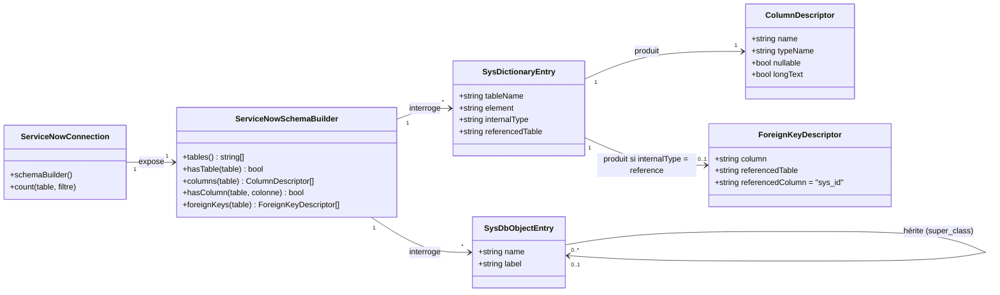
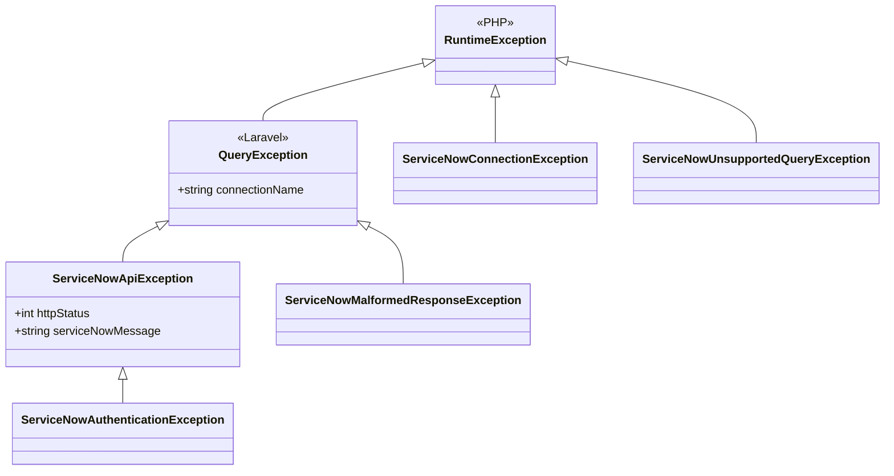

# SFD - Introspection du schéma ServiceNow : compatibilité avec les outils génériques d'exploration de données

## Objectif

Permettre à un outil Laravel générique d'exploration de données — c'est-à-dire tout outil qui découvre les modèles Eloquent d'une application, lit le schéma de leurs tables et en expose le contenu sans rien connaître du driver sous-jacent — de fonctionner sur une connexion ServiceNow exactement comme sur une connexion SQL, en navigation comme en écriture. Ce module s'appuie sur le module 1 ([1. Driver ServiceNow.md](1.%20Driver%20ServiceNow.md)) et complète le module 2 ([2. Génération de modèles ServiceNow.md](2.%20G%C3%A9n%C3%A9ration%20de%20mod%C3%A8les%20ServiceNow.md)).

Le besoin est né du constat suivant : le driver couvre le cycle CRUD par modèle, mais reste muet sur son schéma. Un outil hôte générique interroge le constructeur de schéma de la connexion (liste des tables, colonnes, clés étrangères) et compte les enregistrements pour paginer — deux capacités qu'aucune exigence du module 1 ne couvre, et dont l'absence se manifeste par une erreur PHP de bas niveau plutôt que par une dégradation maîtrisée. Le périmètre retenu place la totalité de l'adaptation dans le driver : aucun outil hôte n'a à connaître ServiceNow, ni à traiter une connexion ServiceNow autrement qu'une connexion SQL.

Ce module ne couvre ni la synchronisation ni la mise en cache des enregistrements eux-mêmes (exclusion héritée du module 1) : seul le schéma, par nature stable, est mis en cache.

## Diagrammes de classes

### Dictionnaire ServiceNow et schéma exposé

### Exceptions vues par l'application hôte

## Exigences fonctionnelles

### Exposition du schéma des tables ServiceNow

<exigence id="EX-301">Le driver doit exposer, pour une connexion ServiceNow, un constructeur de schéma répondant aux mêmes interrogations qu'un driver SQL : liste des tables, existence d'une table, liste des colonnes d'une table, existence d'une colonne, clés étrangères d'une table.</exigence>

<exigence id="EX-302">La liste des tables d'une connexion ServiceNow doit être établie à partir du dictionnaire de l'instance (table sys_db_object) et retourner les noms techniques des tables.</exigence>

<exigence id="EX-303">L'interrogation de l'existence d'une table, de la liste de ses colonnes ou de l'existence d'une de ses colonnes ne doit rapatrier aucun enregistrement de la table concernée.</exigence>

<exigence id="EX-304">La liste des colonnes d'une table doit être établie à partir du dictionnaire de l'instance (table sys_dictionary) et inclure les champs hérités des tables parentes le long de la chaîne d'héritage (super_class), une table ServiceNow spécialisée exposant l'ensemble des champs de ses tables ancêtres.</exigence>

<exigence id="EX-305">L'interrogation du schéma d'une table inexistante doit répondre que la table est absente, sans lever d'exception, tandis qu'un refus d'accès au dictionnaire pour l'utilisateur configuré doit lever une exception explicite, afin de ne jamais présenter un dictionnaire inaccessible comme une instance sans tables.</exigence>

<limite>L'introspection dépend des droits de lecture de l'utilisateur configuré sur sys_db_object et sys_dictionary : un utilisateur dépourvu de ces droits ne peut utiliser aucune fonction d'introspection, alors même que la lecture des enregistrements des tables lui reste possible.</limite>

<limite>L'ordre des colonnes exposées suit la chaîne d'héritage, de la table la plus générale à la table interrogée ; il ne reproduit pas l'ordre d'affichage des champs configuré dans l'interface ServiceNow.</limite>

### Typage des colonnes exposées

<exigence id="EX-306">Chaque colonne exposée doit porter un nom de type appartenant au vocabulaire des types reconnus par les outils d'introspection standards de Laravel (booléen, entier, décimal, date, horodatage, JSON, chaîne, texte long), obtenu par correspondance depuis le type interne ServiceNow du champ.</exigence>

<exigence id="EX-307">Un champ dont le type interne ServiceNow n'a pas de correspondance connue doit être exposé comme une chaîne de caractères, sans faire échouer l'introspection de la table.</exigence>

<exigence id="EX-308">Les champs ServiceNow de texte long (journal, journal_input, html, translated_html, script) doivent être exposés avec un nom de type distinguant le texte long d'une chaîne courte, afin qu'un outil hôte puisse leur réserver un rendu et une saisie multilignes.</exigence>

<exigence id="EX-309">La description d'une colonne doit renseigner l'ensemble des caractéristiques attendues du contrat d'introspection standard de Laravel (nom, type, nullabilité, valeur par défaut, auto-incrément, commentaire), valorisées depuis le dictionnaire ServiceNow lorsque l'information y existe et à une valeur neutre sinon.</exigence>

<limite>Le caractère obligatoire et la longueur maximale déclarés dans le dictionnaire ServiceNow sont exposés à titre descriptif : le driver n'en dérive aucune règle de validation applicative, la conformité d'une valeur restant tranchée par l'instance ServiceNow à l'écriture.</limite>

<limite>Un champ de type choice est exposé comme une chaîne : le contrat d'introspection standard de Laravel ne permettant pas de transporter une liste de valeurs autorisées, un outil hôte proposera une saisie libre plutôt qu'une liste de choix.</limite>

### Exposition des champs de référence comme clés étrangères

<exigence id="EX-310">Un champ de type reference doit être exposé, à l'introspection du schéma, comme une clé étrangère de sa table vers la table qu'il référence, la colonne référencée étant sys_id.</exigence>

<exigence id="EX-311">La table référencée par un champ de type reference doit être lue depuis le dictionnaire ServiceNow, et non déduite du nom du champ.</exigence>

<exigence id="EX-312">Une relation belongsTo générée automatiquement (module 2, EX-207) doit déclarer explicitement le champ de référence ServiceNow comme clé étrangère et sys_id comme clé référencée, afin que la clé étrangère lue par un outil hôte à partir de la relation soit le champ portant réellement la référence, et non un nom de champ dérivé du nom de la méthode de relation.</exigence>

<exigence id="EX-313">Un champ de type reference dont la table référencée est inexistante ou inaccessible pour l'utilisateur configuré ne doit pas être exposé comme clé étrangère, mais comme une colonne ordinaire, sans erreur ni avertissement bloquant.</exigence>

<limite>ServiceNow n'applique aucune contrainte d'intégrité référentielle comparable à celle d'une base relationnelle : une clé étrangère exposée par l'introspection est purement descriptive, et la suppression d'un enregistrement encore référencé n'est jamais bloquée pour ce motif.</limite>

<limite>Les champs référençant plusieurs enregistrements (glide_list) ou dont la table cible dépend de la valeur d'un autre champ (document_id) ne sont pas exposés comme clés étrangères, une clé étrangère ne pouvant désigner qu'une table cible et un enregistrement uniques — même exclusion qu'en EX-208.</limite>

### Comptage des enregistrements d'une table

<exigence id="EX-314">Le driver doit fournir le nombre d'enregistrements d'une table sans rapatrier ces enregistrements, en s'appuyant sur la fonction d'agrégation de l'API ServiceNow.</exigence>

<exigence id="EX-315">Le comptage doit s'appliquer aussi bien à une table entière qu'à un sous-ensemble filtré, les clauses de filtre du query builder étant traduites pour le comptage à l'identique de leur traduction pour la lecture (EX-109).</exigence>

<exigence id="EX-316">La pagination Eloquent (paginate) doit fonctionner sur une table ServiceNow, y compris le nombre total d'enregistrements et le nombre de pages qui s'en déduit.</exigence>

<exigence id="EX-317">Le test d'existence d'au moins un enregistrement correspondant à un filtre doit être satisfait par un appel unique borné à un enregistrement, sans comptage ni rapatriement de l'ensemble des correspondances.</exigence>

<limite>Les agrégats autres que le comptage (somme, moyenne, minimum, maximum) restent hors périmètre et continuent de lever l'exception d'EX-128 : seul le comptage est nécessaire à la pagination.</limite>

<limite>Le nombre retourné porte sur les seuls enregistrements visibles par l'utilisateur configuré, et n'est pas garanti cohérent avec la page effectivement rendue : une écriture concurrente côté ServiceNow entre le comptage et la lecture de la page peut faire varier le total. Un écart est accepté (valeur approchée) plutôt que compensé par un verrouillage, dont l'API Table ne dispose pas (EX-124).</limite>

### Reconnaissance des erreurs par l'application hôte

<exigence id="EX-318">Les exceptions d'erreur de l'API ServiceNow levées par le driver doivent être reconnaissables par une application hôte comme des erreurs de base de données au sens de Laravel, tout en conservant les types spécifiques et distincts exigés par EX-119, EX-120 et EX-130.</exigence>

<exigence id="EX-319">Une exception d'erreur d'API doit porter le nom de la connexion concernée ainsi que le message d'erreur retourné par ServiceNow, afin qu'un outil hôte générique puisse les restituer à l'utilisateur sans connaître le driver.</exigence>

<exigence id="EX-320">Une clause de requête non supportée (EX-128) et une opération de masse rejetée (EX-131) ne doivent pas être reconnaissables comme des erreurs de base de données : ces exceptions doivent rester distinctes des erreurs d'API, afin qu'un outil hôte ne présente jamais une limite du driver comme une violation de contrainte imputable aux valeurs saisies par l'utilisateur.</exigence>

<limite>Le driver ne produit pas de code d'erreur normalisé, et les messages d'erreur de ServiceNow ne suivent aucun des formats propres à MySQL ou PostgreSQL : un outil hôte identifiant la colonne fautive d'une contrainte violée par analyse du message d'erreur n'y parviendra pas sur une connexion ServiceNow, et devra se rabattre sur l'affichage du message brut renvoyé par l'instance.</limite>

### Maîtrise du coût des appels d'introspection

<exigence id="EX-321">Le schéma d'une table (colonnes, types, clés étrangères) doit être mis en cache dès sa première interrogation : une seconde interrogation du même schéma ne doit déclencher aucun appel supplémentaire au dictionnaire.</exigence>

<exigence id="EX-322">La liste des tables de l'instance doit être mise en cache selon le même mécanisme que le schéma d'une table.</exigence>

<exigence id="EX-323">La durée de validité de ce cache doit être configurable par l'application hôte, une durée nulle désactivant le cache.</exigence>

<exigence id="EX-324">Aucune interrogation du dictionnaire ne doit être déclenchée au démarrage de l'application hôte : l'introspection doit rester paresseuse, à la première interrogation effective du schéma, selon le même principe qu'EX-121.</exigence>

<limite>Une modification du dictionnaire côté ServiceNow (champ ajouté, type modifié, référence redirigée) n'est visible qu'après expiration du cache ; un rafraîchissement immédiat suppose de vider le cache de l'application hôte.</limite>

<limite>La vérification de l'existence de chaque enregistrement référencé par une clé étrangère reste à la charge de l'outil hôte et n'est pas mutualisée par le driver : un écran affichant N champs de référence déclenche N appels à l'API Table.</limite>

### Champs exposés par les modèles générés

<exigence id="EX-325">Un modèle généré automatiquement (module 2) doit déclarer explicitement la liste de ses champs modifiables par assignation de masse, établie depuis le dictionnaire ServiceNow et limitée aux champs inscriptibles de la table.</exigence>

<exigence id="EX-326">Les champs techniques gérés par ServiceNow (sys_id, sys_created_on, sys_updated_on, sys_created_by, sys_updated_by, sys_mod_count) doivent être exclus de cette liste, leur modification étant de toute façon rejetée par l'instance.</exigence>

<exigence id="EX-327">Un champ dont le type ServiceNow admet un équivalent de conversion Eloquent (booléen, entier, décimal, horodatage) doit être déclaré en conversion dans le modèle généré, afin que son type soit lisible depuis le code du modèle et pas seulement depuis le dictionnaire.</exigence>

<exigence id="EX-328">L'ordre des champs déclarés dans $fillable d'un modèle généré doit placer en premier, s'il figure parmi les champs modifiables, le champ marqué display par le dictionnaire ServiceNow, puis les champs mandatory, puis les autres champs modifiables dans l'ordre décrit par EX-304, afin que le champ le plus significatif pour identifier un enregistrement soit visible en tête sans consulter le dictionnaire.</exigence>

<exigence id="EX-329">En l'absence de champ display parmi les champs modifiables d'une table (champ display absent du dictionnaire, en lecture seule, ou technique), la liste $fillable doit commencer directement par les champs mandatory, sans champ de tête ni erreur.</exigence>

Si plusieurs champs d'une même table sont marqués display (situation non conforme aux conventions ServiceNow mais non empêchée structurellement par le dictionnaire), seul le premier rencontré dans l'ordre d'EX-304 est placé en tête ; les autres restent classés selon leur seul caractère mandatory.

Comme pour mandatory et read_only, la définition de display retenue pour un champ hérité est la plus spécifique de la chaîne d'héritage : une table enfant peut ainsi désigner un champ display différent de celui de sa table ancêtre.

<exigence id="EX-330">Un champ marqué virtual par le dictionnaire ServiceNow (champ calculé, par exemple sys_user.name calculé depuis first_name/last_name par un script de calcul plutôt que stocké dans une colonne propre) doit être exclu de la liste des champs modifiables d'un modèle généré, même si le dictionnaire ne le marque pas par ailleurs read_only : n'ayant aucun stockage propre en base, toute valeur transmise à l'écriture n'a nulle part où être persistée.</exigence>

Un modèle déclaré manuellement par l'application hôte sans liste de champs modifiables ni conversion (par exemple avec $guarded vide) n'expose aucun champ au travers de son code : un outil hôte restreignant les champs affichés à ceux déclarés par le modèle n'en montrera alors que les champs techniques. Le remède relève de l'application hôte (déclarer ses champs modifiables ou ses conversions) et non du driver.
